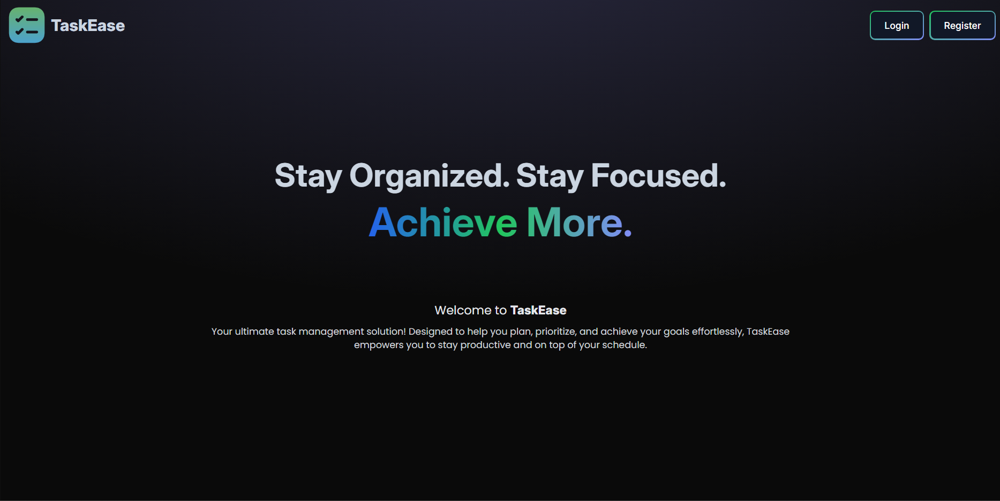
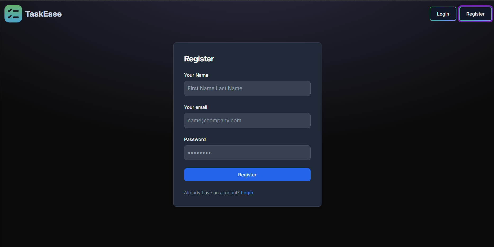
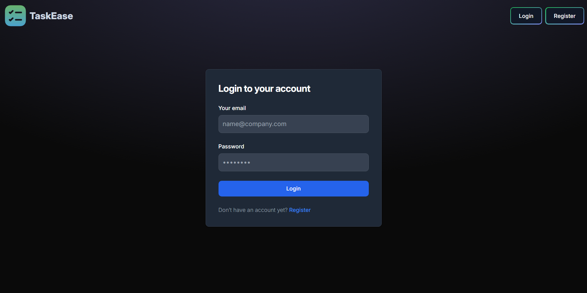
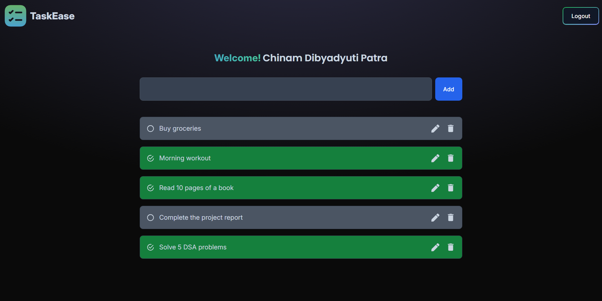

# TaskEase

TaskEase is a powerful and user-friendly task management application designed to help you organize your tasks efficiently. It provides features for creating, updating, deleting, and viewing tasks, along with secure user authentication.

---

## Features

- **User Authentication**: Register and login securely using JWT-based authentication.
- **Task Management**: CRUD operations for tasks.
- **Modern UI**: Built with React and Tailwind CSS for a responsive and dynamic user experience.
- **Backend API**: Developed with Node.js and Express.js, with MongoDB as the database.

---

## Folder Structure

```plaintext
TaskEase/
├── Backend/         # Backend API built with Node.js, Express, and MongoDB
|   |--controllers/
|   |--middlewares/
|   |--models/
|   |--routes/
|   |--services/
|   |--connectionDB.js
|   |--package-lock.json
|   |--package.json
|   |--server.js
|   |--.env
|   |--.gitignore
├── Frontend/        # Frontend React application
|    |--public/
|    |--src/
|    |    |--assets/
|    |    |--components/
|    |    |--contexts/
|    |    |--pages/
|    |    |--services/
|    |    |--App.css
|    |    |--App.jsx
|    |    |--index.css
|    |    |--main.jsx
|    |--eslint.config.js
|    |--index.html
|    |--package-lock.json
|    |--package.json
|    |--postcss.config.js
|    |--tailwind.config.js
|    |--vite.config.js
|    |--.env
|    |--.gitignore
├── README.md        # Project documentation
```

---

## Technologies Used

### Frontend

- React.js
- Vite
- Tailwind CSS
- Axios

### Backend

- Node.js
- Express.js
- MongoDB
- Mongoose
- JSON Web Tokens (JWT)

---

## Prerequisites

- Node.js (v14+ recommended)
- MongoDB (Local or Cloud instance)
- npm or yarn

---

## Backend Configuration

### Setup

1. Navigate to the `Backend` folder:

   ```bash
   cd Backend
   ```

2. Install dependencies:

   ```bash
   npm install
   ```

### Environment Variables

Create a `.env` file in the `Backend` folder with the following content:

```env
PORT_NO=9090
CORS_ORIGIN=http://localhost:5173
MONGO_URI=mongodb://127.0.0.1:27017/task_manager
JWT_SECRET_KEY=$Secret@Key@123$
```

### Run the Backend

Start the backend server:

```bash
npm run dev
```

The backend server will run at `http://localhost:9090`.

---

## Frontend Configuration

### Setup

1. Navigate to the `Frontend` folder:

   ```bash
   cd Frontend
   ```

2. Install dependencies:

   ```bash
   npm install
   ```

### Environment Variables

Create a `.env` file in the `Frontend` folder with the following content:

```env
VITE_BACKEND_BASE_URL=http://localhost:9090
```

### Run the Frontend

Start the React application:

```bash
npm run dev
```

The frontend application will run at `http://localhost:5173`.

---

## Usage

1. Navigate to the frontend in your browser: `http://localhost:5173`.
2. Register a new user account or log in with existing credentials.
3. Manage your tasks by adding, editing, or deleting them.

---

## API Endpoints

### User Authentication

- **POST** `/api/user/register`: Register a new user.
- **POST** `/api/user/login`: Authenticate a user and receive a JWT.

### Tasks

- **GET** `/api/task`: Fetch all tasks.
- **POST** `/api/task`: Create a new task.
- **PATCH** `/api/task/:id`: Update a task by ID.
- **DELETE** `/api/task/:id`: Delete a task by ID.

---

## Screenshots

### Home Page



### Register Page



### Login Page



### User Dashboard



---

## Future Enhancements

- Add a calendar view for tasks.
- Implement reminders and notifications.
- Provide dark mode support.

---

## Contributors

- **Chinam Dibyadyuti Patra** - _Developer_

---
